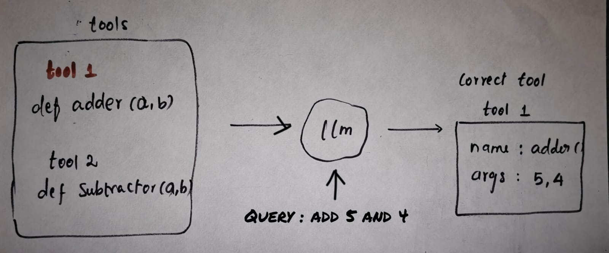
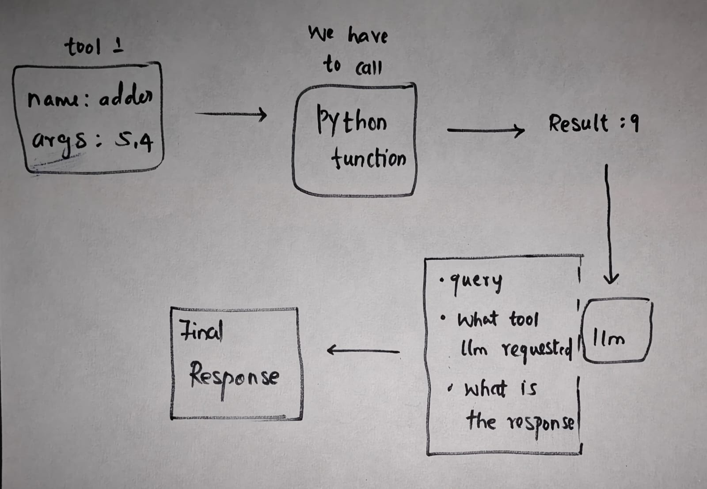

### 2. TOOLS

#### LLM AND TOOLS :

In order to make our **AI agent** powerful and more structured we need to provide them access to **tools**. The tools can be , 
- A Simple **python** function 
- A MCP tool
- A RAG tool
---
#### HOW THE LLM USES TOOLS :

The llm does not directly use those tools , instead it **two important things** :  
1. It **identifies** the correct tool for the user's **query**. Then , return a structured schema with **tool name** , **args** , etc ..,  
2. After , we call the tool with that **structured schema** , we need **AI** to refine the **result**.
---
#### SIMPLE WORKFLOW


- Here the **llm** picks the **proper tool** for the user's **query**.


- After that we call our python function(or **tool**) using the llm's **structured response to call tool**.
- Finally we once again pass the result taken from the tool to **llm** , to make the result as an **human friendly response**.
```python  
python

def 
```
- Also , we need to pass **three** things to maintain the **context** of conversation with llm :   
    1. The user **query**
    2. llm's **tool call request**
    3. tool's **return value**
```python  
python

def 
```
---